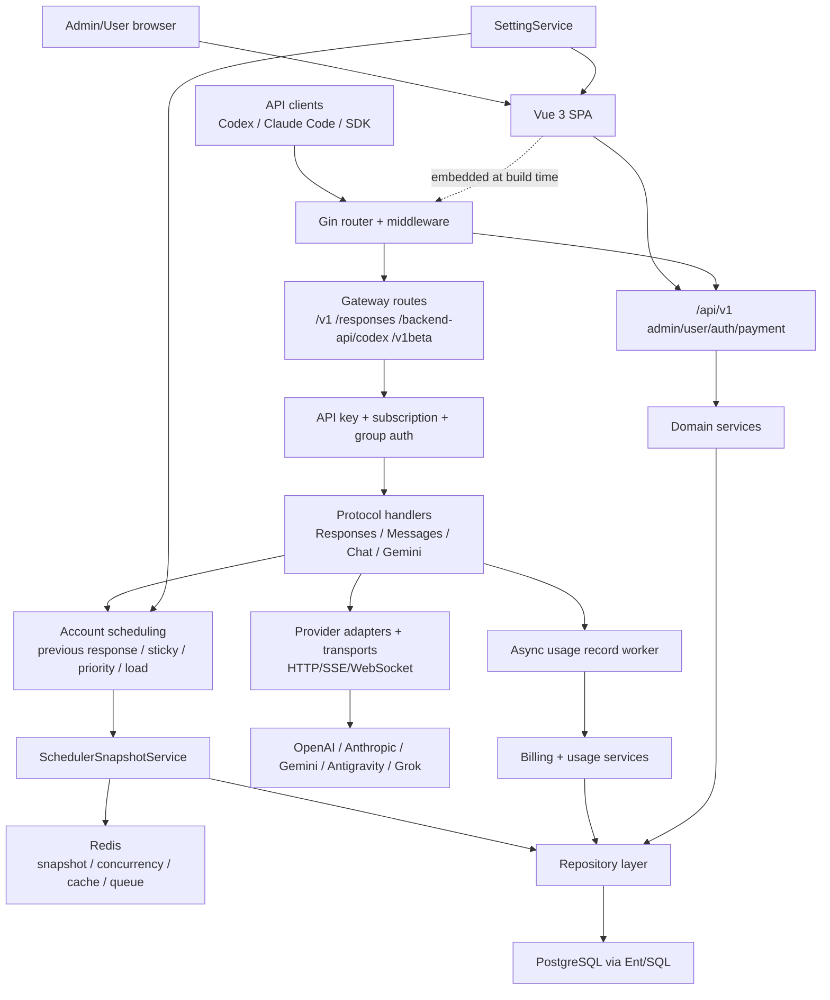

# System architecture

## 总览

系统是单体 Go 服务加嵌入式 Vue SPA，使用 PostgreSQL 保存权威业务状态，Redis 承担缓存、并发槽位、粘性会话、scheduler snapshot、队列和跨实例协调。Google Wire 在启动时组装 repositories、services、handlers、中间件和后台 worker。

## 模块边界

### 启动与 HTTP

- `backend/cmd/server` 负责 setup mode、配置加载、Wire 初始化、HTTP server 和 graceful shutdown。
- `backend/internal/server` 注册全局 middleware、嵌入式前端和 route groups。
- `backend/internal/handler` 负责协议入口、请求解析、错误格式、retry loop 和响应提交边界。

### 业务与持久化

- `backend/internal/service` 包含调度、provider adapter、OAuth、计费、支付、监控、通知和后台 worker。
- `backend/internal/repository` 封装 PostgreSQL/Redis 访问；Ent schema 和 migrations 定义持久状态。
- PostgreSQL 是账号、用户、分组、设置、用量、支付等权威状态。
- Redis 是派生状态和协调层。scheduler cache 可从 DB/outbox 重建，不应被视为唯一事实源。

### 调度

- `SchedulerSnapshotService` 通过 startup/full rebuild 和 scheduler outbox 维护分组/平台/mode bucket。
- 普通 OpenAI 调度按 `previous_response_id`、session sticky、priority/load、并发获取逐层选择。
- [[openai-429-over-limit-routing]] 增加独立候选 bucket，但最终 eligibility 必须在 request-time 用新状态重查。
- handler 以 exclusion set 驱动单次请求 failover，防止同一失败账号再次进入当前循环。

### 前端与发布

- `frontend/src` 是 Vue 3 SPA，使用 router、Pinia、i18n、Tailwind 和 Vitest。
- Docker build 将前端输出复制到 `backend/internal/web/dist` 并用 `embed` tag 编入 Go 二进制。
- [[local-branding-ui-overlay]] 只覆盖默认视觉和页面体验。
- [[coolify-ghcr-release-contract]] 负责自有镜像和生产 compose，不改变后端模块边界。

## 关键架构约束

- middleware 顺序和 response committed 状态决定错误能否 failover，流式路径不能在尝试切换前写出客户端响应。
- HTTP、SSE 和 WebSocket 的限流信号必须汇聚到账户状态持久化。
- scheduler snapshot membership 与 request-time eligibility 是两层不同职责。
- provider-specific hard block、429 probe、model limit 和 quota auto-pause 不能混为一个 cooldown。
- fork overlay 必须服从 [[fork-upstream-merge-boundaries]]。
