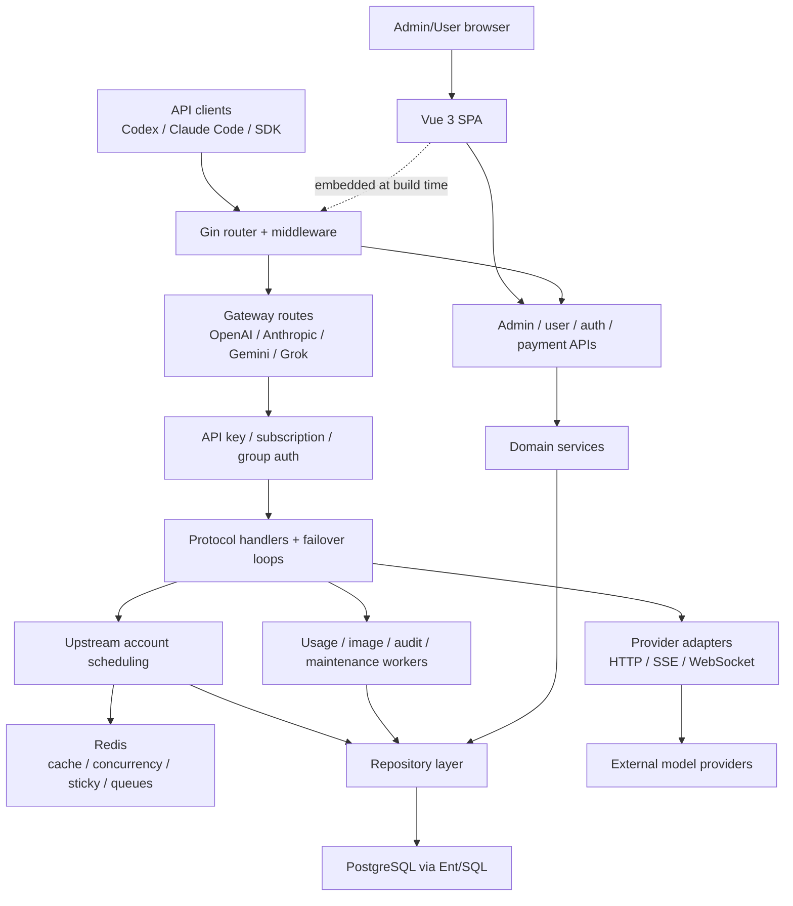

# System architecture

## 总览

系统是单体 Go 服务加嵌入式 Vue SPA。PostgreSQL 保存权威业务状态，Redis 承担缓存、并发槽位、粘性会话、scheduler 投影、队列和跨实例协调。Google Wire 在启动时组装 repositories、services、handlers、中间件和后台 worker。

## 模块边界

### 启动与 HTTP

- `backend/cmd/server` 负责 setup、配置加载、Wire 初始化、HTTP server 和 graceful shutdown。
- `backend/internal/server` 注册 middleware、嵌入式前端和 route groups。
- `backend/internal/handler` 负责协议入口、请求解析、错误格式、重试边界和响应提交。

### 业务与持久化

- `backend/internal/service` 包含调度、provider adapter、OAuth、计费、支付、监控、通知、安全审计和后台任务。
- `backend/internal/repository` 封装 PostgreSQL、Redis、S3/对象存储和上游 HTTP 访问。
- Ent schema 与 SQL migrations 定义持久状态；PostgreSQL 是账号、用户、设置、用量、支付等权威来源。
- Redis 是可重建的派生状态和协调层，不应被视为唯一事实源。

### 网关与调度

- handler、scheduler、provider transport 和错误映射全部由上游版本维护。
- 单次请求的账号选择、并发获取、sticky、429、failover 和 response committed 语义以上游实际代码和测试为准。
- fork 不在这些路径插入本地策略，边界见 [[fork-upstream-merge-boundaries]]。

### 前端与发布

- `frontend/src` 是 Vue 3 SPA，使用 router、Pinia、i18n、Tailwind 和 Vitest。
- Docker build 将前端输出复制到 `backend/internal/web/dist` 并嵌入 Go 二进制。
- [[local-branding-ui-overlay]] 只覆盖默认视觉和响应式体验。
- [[coolify-ghcr-release-contract]] 负责自有镜像与 Coolify compose，不改变后端模块。

## 关键约束

- 上游业务代码冲突默认采用目标 tag，不能把历史本地实现套回新架构。
- middleware 顺序、流式响应提交和状态持久化属于上游行为契约。
- PostgreSQL 权威状态与 Redis 派生状态必须保持可恢复边界。
- 任何第三类本地运行时差异都必须先形成新的明确决策。
