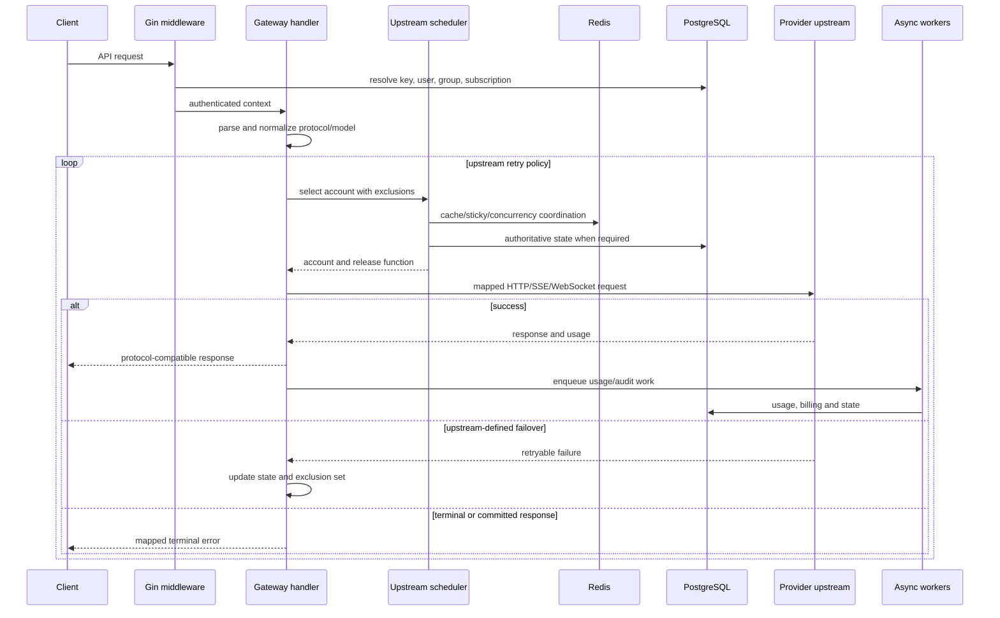
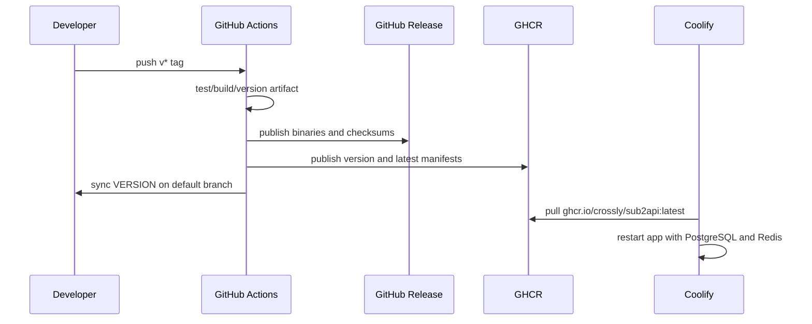

# Key flows

## 典型网关请求

429、OAuth、账号切换和错误分类全部采用上游目标版本；fork 不再定义独立探测或优先级语义。

## 上游升级流程

```mermaid
flowchart LR
    Fetch["Fetch and verify upstream tag"] --> Base["Confirm merge-base"]
    Base --> Merge["Merge tag without immediate commit"]
    Merge --> Resolve["Use upstream for business conflicts"]
    Resolve --> Restore["Reapply Coolify and branding overlays"]
    Restore --> Audit["Diff result against upstream tag"]
    Audit --> Test["Backend, frontend, lint, compose checks"]
    Test --> Commit["Create merge commit"]
```

反向审计必须确认 `backend/`、`Dockerfile` 和 `deploy/` 与目标 tag 一致，剩余差异只属于 [[coolify-ghcr-release-contract]]、[[local-branding-ui-overlay]] 和 Project Brain。

## 发布与 Coolify

