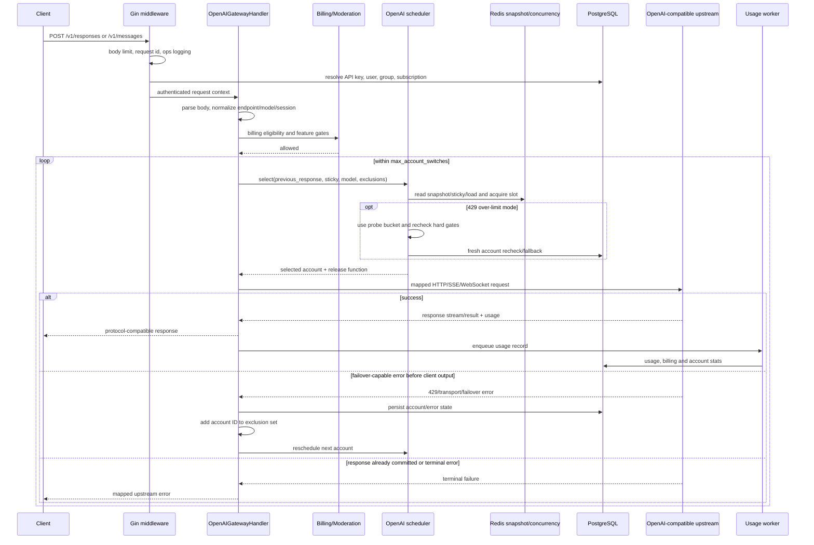
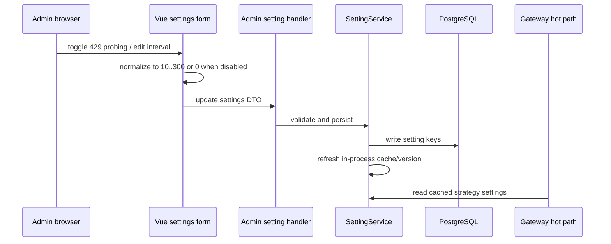

# Key flows

## 典型 OpenAI 请求链

## 429 特殊闭环

启用 [[openai-429-over-limit-routing]] 时：

1. SettingService 从数据库读取开关和 10 到 300 秒 probe interval，并用短 TTL 缓存。
2. scheduler 使用 `SchedulerModeOpenAIOverLimit` 候选 bucket。
3. request-time policy 只放松仍在 `RateLimitResetAt` 窗口内的账号级 429，并要求 `RateLimitedAt + interval` 已到。
4. 账号仍须通过 active、expiry、overload、temp-unschedulable、model、capability、channel、runtime hard block 和 concurrency gate。
5. HTTP/SSE/WS 429 先写入 rate-limit state。
6. 若客户端响应尚未提交，handler 将当前账号加入 `failedAccountIDs` 并选择下一账号。
7. 健康账号成功后进入正常 usage/billing 记录；失败账号等待下一 probe interval。

## 管理设置链

## 数据一致性

- PostgreSQL 账号和设置是权威状态。
- Redis scheduler snapshot 是可重建投影，outbox 和 full rebuild 负责收敛。
- 选择前的 fresh/DB recheck 用来防止 snapshot 延迟把刚刚被限流或禁用的账号重新选中。
- usage 写入在 worker pool 中异步执行，但 billing eligibility 在转发前同步检查。
