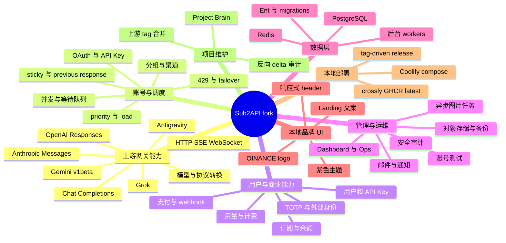

# Feature mindmap

## 功能地图

## 活动知识页

- [[fork-upstream-merge-boundaries]]：上游所有权和只保留两个 overlay 的规则。
- [[coolify-ghcr-release-contract]]：Coolify、GHCR 与 tag-driven release。
- [[local-branding-ui-overlay]]：默认品牌、主题和响应式前端。

429 与 OAuth 历史页面已归档。它们只解释过去版本，不代表当前 fork 行为。

## 维护视角

大部分业务能力由上游维护。本 fork 的审阅重点只在部署和视觉差异，以及它们与上游 release workflow、Docker 构建和前端组件结构的交点。
