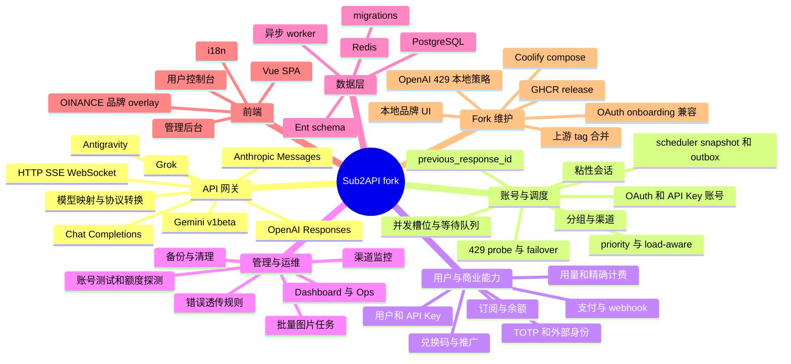

# Feature mindmap

## 功能地图

## 关键知识页

- [[fork-upstream-merge-boundaries]]：哪些能力跟随上游，哪些属于 fork。
- [[openai-429-over-limit-routing]]：429 账号如何重新探测并回退。
- [[coolify-ghcr-release-contract]]：Coolify 与 tag-driven release。
- [[local-branding-ui-overlay]]：默认品牌、主题和响应式前端。
- [[openai-oauth-onboarding-compat]]：本地导入和测试前 token 刷新。

## 维护视角

功能地图中的大部分业务能力由上游维护。本 fork 的主要风险集中在“Fork 维护”分支和它们与 scheduler、handler、release workflow 的交点。新需求应先判断属于上游通用能力还是本地 overlay，再选择落点。
