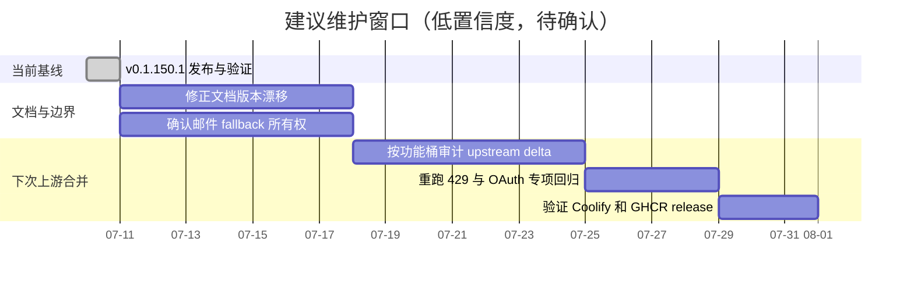

# Roadmap

## 状态

截至 2026-07-10：

- 上游 `v0.1.150` 已合并。
- [[openai-429-over-limit-routing]] 已按 v150 架构重做并通过 main/tag CI。
- `v0.1.150.1` GitHub Release 与 GHCR 发布成功。
- [[coolify-ghcr-release-contract]]、[[local-branding-ui-overlay]] 和 [[openai-oauth-onboarding-compat]] 均存在于当前代码。

## 维护路线而非产品承诺

仓库中没有经过用户确认的长期产品 roadmap。下面只把现有维护文档和历史流程整理为建议检查窗口，不代表承诺日期。

## 每次上游 release 的固定门槛

1. 依据 [[fork-upstream-merge-boundaries]] 识别 merge base 和本地 delta。
2. 先合并上游，再恢复独立 overlay。
3. 对 [[openai-429-over-limit-routing]] 复核 snapshot、eligibility、runtime block、HTTP/SSE/WS ingestion 和所有 retry loop。
4. 对 [[openai-oauth-onboarding-compat]] 复核 Wire 构造参数、刷新测试和 import schema。
5. 对 [[local-branding-ui-overlay]] 复核 fallback logo、landing locale、移动端 guard tests。
6. 对 [[coolify-ghcr-release-contract]] 复核 image、GoReleaser manifest、tag CI、Security Scan 和 Release。
7. 所有检查通过后才发布 fork tag。

## 待用户确认

- 下一次计划跟进的上游版本和发布时间。
- legacy email fallback 是否继续本地品牌化，还是完全交还上游模块。
- `codex_txt_to_sub2api` 是否是长期支持工具，还是一次性迁移工具。
- 是否把当前维护检查进一步自动化为 merge audit 脚本。
- 除维护上游兼容外，是否存在独立产品目标、商业目标或功能优先级。

在这些问题确认前，不应把示意日期当成实际排期。
